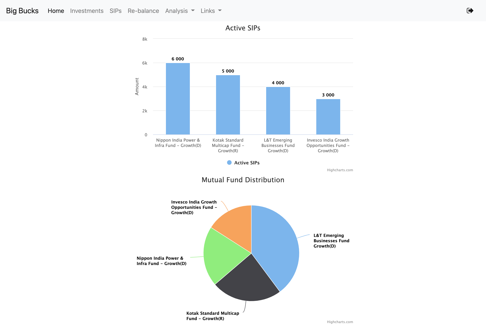

## Big Bucks

Big Bucks is an application for tracking all your investments across different mutual funds. Just declare all your SIPs of mutual funds and watch your money grow. 

Also, get interesting insights into your portfolio like sector/stock wise distribution of the investments, 
popular stocks from the portfolio, e.t.c., Want to rebalance your portfolio, but confused about which mutual fund to invest in? No problem, create an investment plan and see how it compares with your existing one. Make investments as per the new plan, sit back and relax.

### Sneak peek

#### Home page

---

#### Portfolio Analysis

---

#### Portfolio Rebalance

---

### Check it out

Start investment tracking today by creating an account on http://money.freethunder.com/

